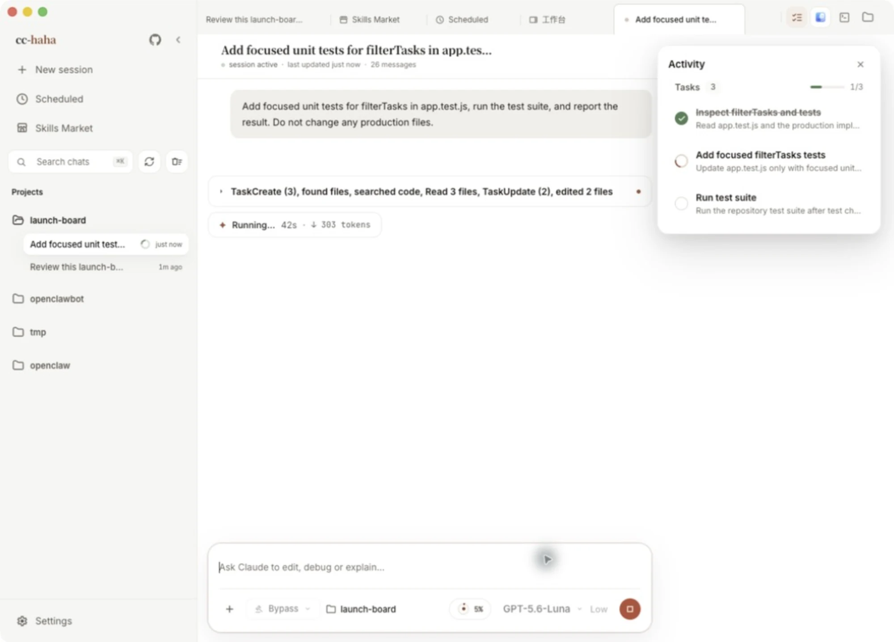
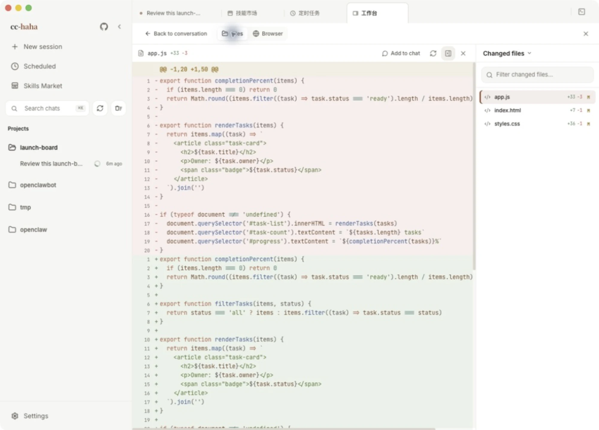
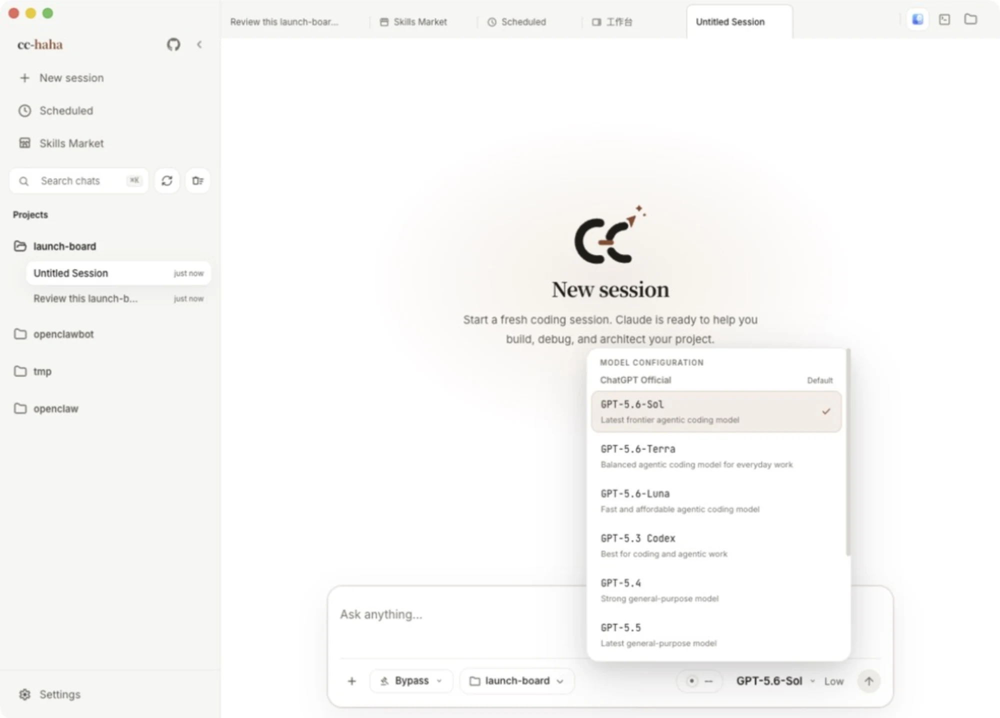

# Code Council

<p align="center">
  <picture>
    <source media="(prefers-color-scheme: dark)" srcset="docs/images/logo-horizontal-dark.png">
    
  </picture>
</p>

<div align="center">

[](https://github.com/706412584/cc-haha/stargazers)
[](https://github.com/706412584/cc-haha/network/members)
[](https://github.com/706412584/cc-haha/issues)
[](https://github.com/706412584/cc-haha/pulls)
[](https://github.com/706412584/cc-haha/blob/main/LICENSE)
[](README.md)
[](README.zh-CN.md)
[](https://cchaha.ai)

**English** · [简体中文](README.zh-CN.md)

</div>

**Code Council** is a customized desktop Claude Code workspace for macOS, Windows, and Linux, built on top of the open-source Claude Code. It adds relay-provider resilience, smarter retry logic, refined UX, and curated provider presets — all without sponsored placements or promotional links.

<p align="center">
  <a href="#desktop-preview">Desktop Preview</a> · <a href="#install-the-desktop-app">Install</a> · <a href="#code-council-customizations">Customizations</a> · <a href="#desktop-highlights">Highlights</a> · <a href="#more-documentation">More Docs</a>
</p>

---

## Desktop Preview

<p align="center">
  <a href="https://github.com/706412584/cc-haha/releases"></a>
</p>

<table>
  <tr>
    <td align="center" width="33.33%"><br><b>Start with a clear, empty session</b><br><sub>Project and permissions stay visible</sub></td>
    <td align="center" width="33.33%"><br><b>Follow the task as it runs</b><br><sub>Tool calls and stage-by-stage progress stay in view</sub></td>
    <td align="center" width="33.33%"><br><b>See exactly what changed</b><br><sub>A focused, full-width syntax-highlighted diff</sub></td>
  </tr>
  <tr>
    <td align="center" width="33.33%"><br><b>Verify on the spot</b><br><sub>The real edited page in the built-in browser</sub></td>
    <td align="center" width="33.33%"><br><b>Choose the exact model</b><br><sub>Your providers, presets, and local endpoints in one list</sub></td>
    <td align="center" width="33.33%"><br><b>Missing a trick? Install it</b><br><sub>Source and safety status shown up front</sub></td>
  </tr>
</table>

---

## Code Council Customizations

These are the changes Code Council makes on top of upstream Claude Code:

### Relay Provider Resilience

- **`get_channel_failed` auto-retry**: when a relay/proxy provider (e.g. cchh) returns a channel-allocation failure, the client automatically retries up to 10 times with exponential back-off instead of surfacing an error immediately. On exhaustion, a friendly message is shown: "中转服务商通道繁忙，请稍后重试".
- **`api_error` 5xx auto-retry**: relay providers that wrap transient upstream failures in an `api_error` body with a 5xx HTTP status are now silently retried, matching the same logic as statusless stream errors. Deterministic 4xx `api_error` responses are not retried.
- **Proxy `thinking` passthrough**: OpenAI-format third-party providers always receive the `thinking` toggle and `reasoning_content` fields, preventing silent drops of reasoning by upstream gateways.
- **`xhigh` reasoning tier preserved**: the `xhigh` inference level for K3/compatible models is retained across upstream merges and never silently downgraded.

### UX Fixes

- **Esc pause is respected**: pressing Esc to pause no longer gets overridden by background agent `task-notification` events. Notifications are queued and delivered with the user's next real input.
- **Background agent completion fidelity**: completion notifications report actual file-edit counts (`file_edits=N`) so orchestrators can tell whether an agent actually wrote anything, instead of trusting a bare "completed" status.
- **Cold-reconnect stop stability**: the stop signal path after a reconnect is hardened so agents no longer appear to keep running after being stopped.

### Provider Presets

- **Promoted/sponsored slots removed**: TeamoRouter, 玄枢API, FennoAI, and 七牛云AI are retired to `deprecated` tombstones — no promotional links or featured placement. Already-configured users can still run them.
- **接口AI restored**: available as an optional preset without any advertising copy.

---

## Install the Desktop App

1. Download the macOS / Windows / Linux desktop installer from [Releases](https://github.com/706412584/cc-haha/releases).
2. On first launch, configure your model provider, API key, and default model in Settings.
3. Unsigned Windows installers may show SmartScreen; click "More info" → "Run anyway". See the [desktop installation guide](docs/en/start/install.md).

## Run the CLI from Source

```bash
bun install
cp .env.example .env
./bin/claude-haha
```

See [environment variables](docs/en/cli/env.md) and [CLI setup](docs/en/cli/index.md) for more configuration options.

---

## Desktop Highlights

- **Multi-session workspace**: tabs, project switching, terminal entry, and session history in one place, with a resizable sidebar.
- **Branch / Worktree launch**: choose a repository branch and decide whether to use the current working tree or an isolated Worktree.
- **Review edits file by file**: the workspace lists this turn's changes; open any file for a syntax-highlighted diff, or undo the whole turn.
- **Five permission modes**: from "ask every time" to "skip permissions" — risky commands, tool calls, and follow-up questions are all approved in the GUI.
- **Bring your own model**: sign in to Claude, ChatGPT, or Grok; use presets for DeepSeek, Kimi, Zhipu GLM and others; or point it at LM Studio and Ollama running locally.
- **Six colour themes**: white, paper, warm classic, celadon, ink night, and ink blue — optionally following your system's light/dark setting.
- **Skill marketplace**: discover, preview, and install third-party skills from ClawHub / SkillHub, with source and safety status shown up front.
- **Session activity panel**: track task progress, background tasks, SubAgents, and sources in one side panel.
- **Computer Use**: let the agent take screenshots, click, type, and control desktop apps after authorization.
- **H5 remote access**: scan a QR code to continue the session in your phone browser; locking the screen won't kill a running task.
- **IM integration**: chat, switch projects, and approve actions through Telegram / Feishu / WeChat / DingTalk / WhatsApp.
- **Scheduled tasks and usage stats**: run planned tasks in their own sessions and track local token usage trends.

---

## More Documentation

Full documentation site: <https://cchaha.ai>

| Section | Documents |
|------|------|
| **Getting started** | [What this is](docs/en/start/index.md) · [Download and install](docs/en/start/install.md) · [Connect a model provider](docs/en/start/models.md) · [Your first session](docs/en/start/first-session.md) · [Troubleshooting](docs/en/start/troubleshooting.md) |
| **Desktop features** | [Feature overview](docs/en/desktop/index.md) · [Computer Use](docs/en/desktop/computer-use.md) · [Desktop pets](docs/en/desktop/pets.md) · [Phone H5 and IM relay](docs/en/desktop/remote.md) |
| **IM integrations** | [Overview and pairing](docs/en/im/index.md) · [Feishu](docs/en/im/feishu.md) · [Telegram](docs/en/im/telegram.md) · [WeChat](docs/en/im/wechat.md) · [DingTalk](docs/en/im/dingtalk.md) · [WhatsApp](docs/en/im/whatsapp.md) |
| **CLI** | [Install and run](docs/en/cli/index.md) · [Command reference](docs/en/cli/reference.md) · [Environment variables](docs/en/cli/env.md) |
| **Internals** | [Desktop architecture](docs/en/internals/desktop.md) · [Multi-agent system](docs/en/internals/agent.md) · [Skills system](docs/en/internals/skills.md) · [Memory system](docs/en/internals/memory.md) · [Computer Use architecture](docs/en/internals/computer-use.md) · [Local server and API](docs/en/internals/server.md) · [Channel system](docs/en/internals/channel.md) · [Project structure](docs/en/internals/structure.md) · [Contributing and quality gates](docs/en/internals/contributing.md) |

---

## Tech Stack

| Category | Technology |
|------|------|
| Language | TypeScript |
| Desktop app | Electron |
| Desktop UI | React + Vite |
| Local runtime | [Bun](https://bun.sh) |
| Terminal UI | React + [Ink](https://github.com/vadimdemedes/ink) |
| CLI parsing | Commander.js |
| API | Anthropic SDK |
| Protocols | MCP, LSP |

## Acknowledgements

Thanks to the following open-source projects and community practices for reference and inspiration:

- [Claude Code](https://github.com/anthropics/claude-code): the upstream project this is built on.
- [React](https://github.com/facebook/react): frontend engineering and component-based UI ecosystem.
- [Electron](https://github.com/electron/electron): cross-platform desktop app capabilities and engineering practices.
- [cc-switch](https://github.com/farion1231/cc-switch): reference for model provider configuration.

---

## ⭐ Star History

<a href="https://www.repostars.dev/?repos=706412584%2Fcc-haha&theme=ocean">
  
</a>
