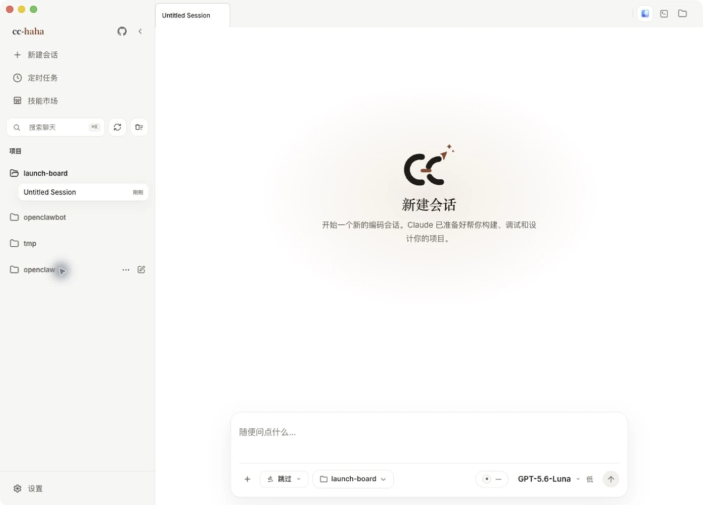
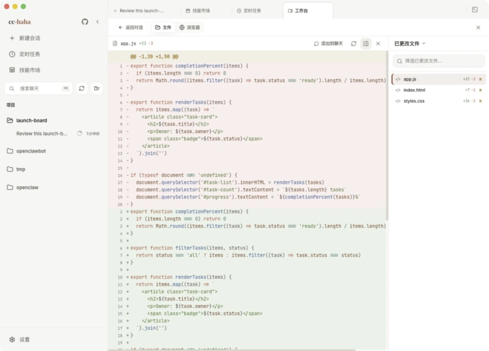
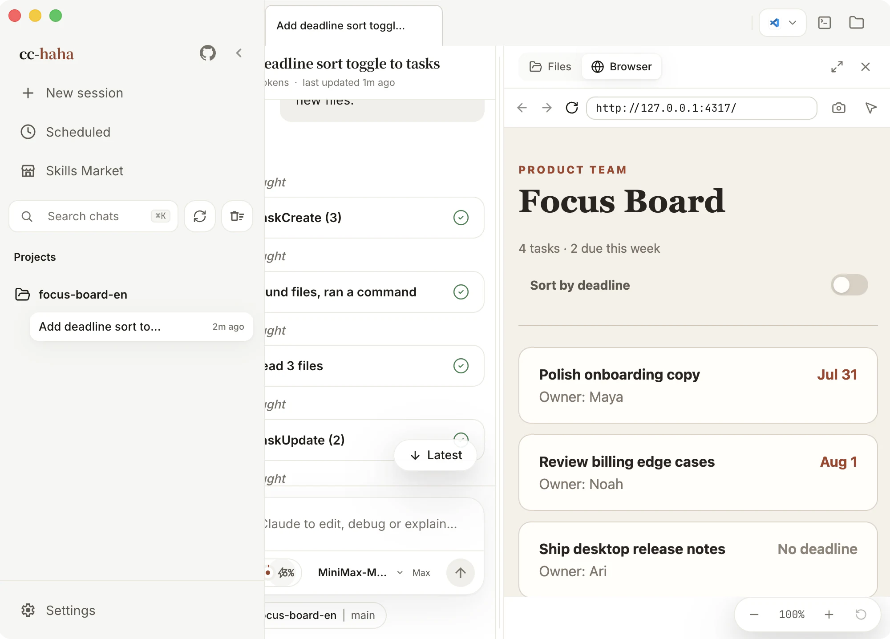
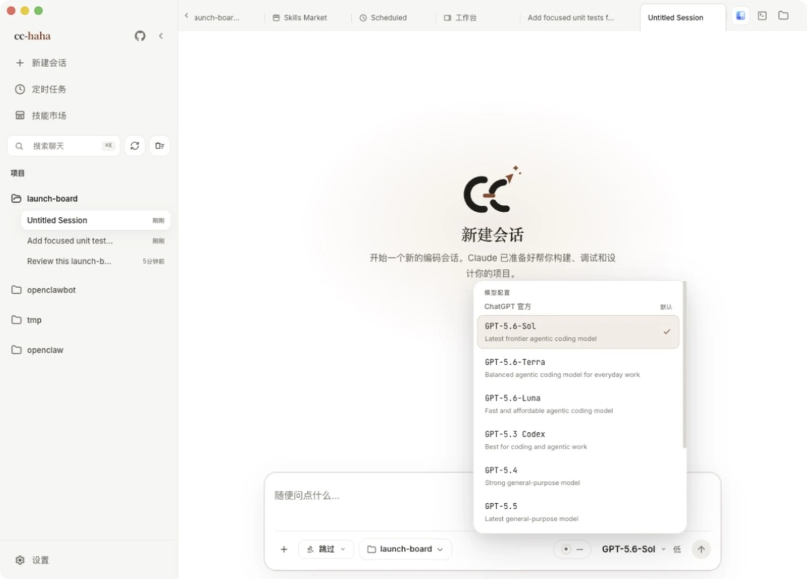
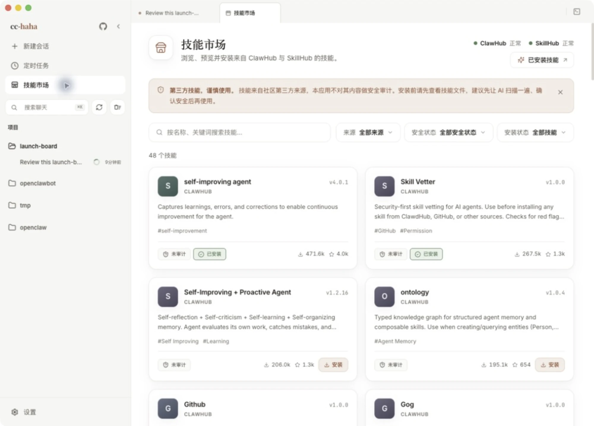

# Code Council

<p align="center">
  <picture>
    <source media="(prefers-color-scheme: dark)" srcset="docs/images/logo-horizontal-dark.png">
    
  </picture>
</p>

<div align="center">

[](https://github.com/706412584/cc-haha/stargazers)
[](https://github.com/706412584/cc-haha/network/members)
[](https://github.com/706412584/cc-haha/issues)
[](https://github.com/706412584/cc-haha/pulls)
[](https://github.com/706412584/cc-haha/blob/main/LICENSE)
[](README.zh-CN.md)
[](README.md)
[](https://cchaha.ai)

[English](README.md) · **简体中文**

</div>

**Code Council** 是基于开源 Claude Code 构建的定制版桌面工作台，适用于 macOS、Windows 和 Linux。在上游基础上增加了中转服务商韧性、更智能的重试逻辑、精细化 UX 改进和经过筛选的 Provider 预设——不含任何赞助广告与推广链接。

<p align="center">
  <a href="#桌面端预览">桌面端预览</a> · <a href="#安装桌面端">安装桌面端</a> · <a href="#code-council-定制内容">定制内容</a> · <a href="#桌面端亮点">桌面端亮点</a> · <a href="#更多文档">更多文档</a>
</p>

---

## 桌面端预览

<p align="center">
  <a href="https://github.com/706412584/cc-haha/releases"></a>
</p>

<table>
  <tr>
    <td align="center" width="33.33%"><br><b>从清爽的空会话开始</b><br><sub>项目和权限都在首屏</sub></td>
    <td align="center" width="33.33%"><br><b>跟着任务一步步往前</b><br><sub>工具调用与阶段进度都留在眼前</sub></td>
    <td align="center" width="33.33%"><br><b>改了什么，逐行看清楚</b><br><sub>放大的高亮 Diff，文字和代码更清楚</sub></td>
  </tr>
  <tr>
    <td align="center" width="33.33%"><br><b>改完当场验证</b><br><sub>内置浏览器打开真实本地页面</sub></td>
    <td align="center" width="33.33%"><br><b>每条会话自选模型</b><br><sub>自己的服务商、预设和本地端点都在一个列表里</sub></td>
    <td align="center" width="33.33%"><br><b>缺什么手艺装什么</b><br><sub>来源和安全状态摆在明处</sub></td>
  </tr>
</table>

---

## Code Council 定制内容

以下是 Code Council 在上游 Claude Code 基础上的定制改动：

### 中转服务商韧性

- **`get_channel_failed` 自动重试**：cchh 等中转服务商通道分配失败时，客户端自动重试（最多 10 次指数退避）而非直接报错。重试耗尽后显示友好消息「中转服务商通道繁忙，请稍后重试」。
- **`api_error` 5xx 自动重试**：中转服务商将瞬时上游故障包装为带 5xx 状态码的 `api_error` 时，现在也会静默重试，与无状态码流错误的处理逻辑保持一致。4xx 的确定性 `api_error` 不重试。
- **Proxy 层 thinking 透传**：OpenAI Chat 格式的第三方 Provider 始终透传 `thinking` toggle 和 `reasoning_content`，避免上游网关静默丢弃推理内容。
- **`xhigh` 推理档位保留**：K3/兼容模型的 `xhigh` 推理档位在每次上游合并中均予以保留，不会被静默回落。

### UX 修复

- **Esc 暂停不被任务通知唤醒**：用户按 Esc 暂停后，后台 Agent 的 `task-notification` 不会立刻开新一轮主对话。通知保留在队列中，随用户下一次真实输入一并送达。
- **后台子代理完成可信度**：完成通知现在报告实际文件编辑次数（`file_edits=N`），编排层可据此判断 Agent 是否真的写了文件，而不是只信任一个空的 "completed" 状态。
- **冷重连后 stop 路径稳定**：修复冷重连后停止失败导致 Agent「已停但仍像在跑」的悬挂状态。

### Provider 预设

- **赞助推广位全部移除**：TeamoRouter、玄枢API、FennoAI、七牛云AI 改为 `deprecated` 墓碑，不再展示推广链接和 featured 位。已配置用户仍可正常使用。
- **接口AI 恢复**：作为可选预设提供，不带任何广告文案。

---

## 安装桌面端

1. 前往 [Releases](https://github.com/706412584/cc-haha/releases) 下载 macOS / Windows / Linux 桌面端安装包。
2. 首次启动后，在桌面端设置里配置模型提供商、API Key 和默认模型。
3. Windows 未签名安装包可能出现 SmartScreen 提示，点「更多信息」→「仍要运行」即可。详见 [桌面端安装指南](docs/start/install.md)。

## 从源码启动 CLI

```bash
bun install
cp .env.example .env
./bin/claude-haha
```

更多配置见 [环境变量](docs/cli/env.md) 和 [命令行安装与启动](docs/cli/index.md)。

---

## 桌面端亮点

- **多会话工作台**：标签页、项目切换、终端入口和会话历史集中管理，侧边栏宽度可拖拽。
- **分支 / Worktree 启动**：新会话可以选择仓库分支，并决定用当前工作树还是隔离 Worktree。
- **改动逐个文件审阅**：右侧工作区列出本轮改动，点开就是带语法高亮的 Diff，整轮可撤销。
- **五档权限模式**：从「询问权限」到「跳过权限」，危险命令、工具调用和 AI 反问都在桌面端审批。
- **模型自选**：Claude / ChatGPT / Grok 官方账号可直接登录；DeepSeek、Kimi、智谱 GLM 等第三方 API 有现成预设；LM Studio、Ollama 的本地模型也接得上。
- **六套配色主题**：纯白、纸墨、经典暖色、青瓷、墨夜、墨夜蓝，可跟随系统深浅色自动切换。
- **技能市场**：发现、预览、安装 ClawHub / SkillHub 的第三方技能，来源和安全状态摆在明处。
- **会话活动面板**：集中查看任务进度、后台任务、SubAgent 与来源。
- **Computer Use**：让 Agent 在授权后截图、点击、输入并控制桌面应用。
- **桌面宠物**：搭搭、弧弧、补补、回回随任务状态换动作，也能自己做一只（默认关闭）。
- **H5 远程访问**：扫码用手机浏览器接入当前会话，锁屏切后台都不打断正在跑的任务。
- **IM 接入**：通过 Telegram / 飞书 / 微信 / 钉钉 / WhatsApp 远程对话、切换项目和审批权限。
- **定时任务与用量统计**：创建计划任务在独立会话执行，并查看本机 Token 使用趋势。

---

## 更多文档

完整文档站：<https://cchaha.ai>

| 分区 | 文档 |
|------|------|
| **开始使用** | [这是什么](docs/start/index.md) · [下载与安装](docs/start/install.md) · [连接模型服务](docs/start/models.md) · [跑通第一条会话](docs/start/first-session.md) · [故障排查](docs/start/troubleshooting.md) |
| **桌面端功能** | [功能总览](docs/desktop/index.md) · [Computer Use](docs/desktop/computer-use.md) · [桌面宠物](docs/desktop/pets.md) · [手机 H5 与 IM 接力](docs/desktop/remote.md) |
| **IM 接入** | [总览与配对流程](docs/im/index.md) · [飞书](docs/im/feishu.md) · [Telegram](docs/im/telegram.md) · [微信](docs/im/wechat.md) · [钉钉](docs/im/dingtalk.md) · [WhatsApp](docs/im/whatsapp.md) |
| **命令行** | [安装与启动](docs/cli/index.md) · [命令参考](docs/cli/reference.md) · [环境变量](docs/cli/env.md) |
| **深入原理** | [桌面端架构](docs/internals/desktop.md) · [多 Agent 系统](docs/internals/agent.md) · [Skills 系统](docs/internals/skills.md) · [记忆系统](docs/internals/memory.md) · [Computer Use 架构](docs/internals/computer-use.md) · [本地 Server 与 API](docs/internals/server.md) · [Channel 系统](docs/internals/channel.md) · [项目结构](docs/internals/structure.md) · [参与贡献与质量门禁](docs/internals/contributing.md) |

---

## 技术栈

| 类别 | 技术 |
|------|------|
| 语言 | TypeScript |
| 桌面 APP | Electron |
| 桌面 UI | React + Vite |
| 本地运行时 | [Bun](https://bun.sh) |
| 终端 UI | React + [Ink](https://github.com/vadimdemedes/ink) |
| CLI 解析 | Commander.js |
| API | Anthropic SDK |
| 协议 | MCP, LSP |

## 致谢

感谢以下开源项目和社区实践为本项目提供参考与启发：

- [Claude Code](https://github.com/anthropics/claude-code)：本项目基于的上游开源项目。
- [React](https://github.com/facebook/react)：前端工程与组件化 UI 生态。
- [Electron](https://github.com/electron/electron)：跨端桌面应用能力与工程实践。
- [cc-switch](https://github.com/farion1231/cc-switch)：模型供应商配置能力参考。

---

## ⭐ Star History

如果这个项目对你有帮助，欢迎点一个 ⭐ Star，让更多人发现 Code Council。

<a href="https://www.repostars.dev/?repos=706412584%2Fcc-haha&theme=ocean">
  
</a>
