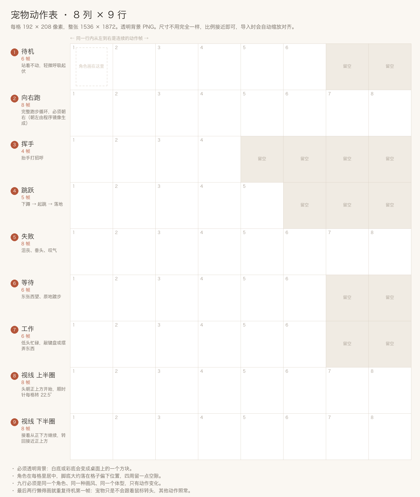

# 桌面宠物

桌面宠物是 Claude Code Haha Desktop 的透明悬浮窗口。它会用动作反映本机任务状态，并提供一个轻量的活跃任务入口。宠物不会替你审批权限，也不能在悬浮窗口里直接输入追问。

::: info 适用范围
宠物只在 Electron 桌面端运行，不会显示在 H5 页面中。它不会扩大当前会话、模型或工具的权限。
:::

## 开启宠物

1. 打开 Claude Code Haha Desktop，点击左下角的设置按钮。
2. 在设置侧边栏选择「宠物」。
3. 从「内置宠物」中选择一个角色。
4. 打开「显示桌面宠物」。
5. 按需要调整宠物大小、动画和任务面板。


应用内置四个完整动画角色：

| 角色 | 特点 |
|------|------|
| 搭搭 Dada | 沉稳的协作机器人 |
| 弧弧 Huhu | 拿着铅笔和计划本的路线机器人 |
| 补补 Bubu | 举着修补扳手的修复机器人 |
| 回回 Huihui | 抱着构建齿轮的构建机器人 |

选择新角色后，已经打开的宠物窗口会同步更新。关闭「播放动画」只会停止动作，不会关闭宠物或任务入口。

## 和宠物互动

宠物窗口支持这些直接操作：

- **悬停**：宠物空闲时会跳跃，并跟随指针改变视线。
- **单击宠物**：唤起 Claude Code Haha 主窗口，同时播放挥手动作。
- **拖动宠物**：按住宠物本体移动到桌面的其他位置；重新打开应用后会尽量恢复上次位置。
- **右键宠物**：在系统菜单中选择「关闭宠物」。
- **重新打开**：回到「设置 → 宠物」，重新打开「显示桌面宠物」。

单击宠物只会唤起主窗口，不会自动进入某条会话。要返回具体任务，请使用宠物旁边的任务面板。

## 查看活跃任务

开启「显示进行中的任务区域」后，有活跃任务时，宠物旁边会出现任务面板。关闭这个选项时，活跃任务会收起为数字徽标；点击徽标即可展开。

面板会反映当前仍需要关注的本机会话，例如：

- **工作中**：会话、后台任务或 Agent 正在运行。
- **等待你处理**：会话正在等待权限审批或其他用户操作。
- **需要关注**：会话最近一次运行失败或出现错误。

点击任务行会唤起主窗口并返回对应会话。权限仍要在主窗口的会话界面中检查和批准，宠物本身不能批准或拒绝权限。

任务完成并回到空闲状态后，会从活跃任务面板中消失；这不代表会话或历史记录被删除。面板只显示最近的活跃会话，不是完整的会话列表。

## 添加自定义宠物

在「你的宠物」右侧点击「添加宠物」，可以选择三种做法。图片全程在你自己的电脑上处理，不会上传，也不会消耗对话额度。


无论选择哪种方式，都需要填写：

- **宠物 ID**：最多 73 个字符，只使用小写字母、数字和单个连字符，例如 `docs-bot`。
- **显示名称**：在宠物列表中显示的名称。
- **宠物描述**：帮助你区分不同角色和用途。

创建成功后，新角色会出现在「你的宠物」中并被自动选中。


### 做法一：用一张现成的图

最省事，大约一分钟。选一张背景透明的静态 PNG 或 WebP，应用会在本地加上呼吸、漂浮和任务状态等轻动画。

图片需要满足：

- 文件格式为静态 PNG 或 WebP，不支持 APNG 或动态 WebP。
- 宽和高都在 `32–4096` 像素之间。
- 总像素数不超过 `16,777,216`。
- 文件大小不超过 `8 MB`。

这种宠物只会轻轻晃动，**不会真的跑起来，也不会跟着鼠标转头**。想要完整动作，用下面的做法二。

### 做法二：用 AI 画一只会跑会跳的

大约十分钟，需要一个能画图的 AI。弹窗里会把提示词、对照模板和检查清单都列出来，跟着走即可。

#### 第一步：让 AI 画一张动作表

打开任意能画图的 AI（即梦、Nano Banana、ChatGPT 画图、Midjourney、Stable Diffusion 都可以；这里只是举例，不构成推荐），把下面这段整个发给它，并把「角色」两行换成你想要的样子：

```text
帮我画一张游戏角色动作表（sprite sheet）。

【角色】
一只圆头圆脑的橘色小猫，戴着蓝色小围巾，Q 版三头身，
3D 卡通渲染，表面柔和有光泽，颜色明快。
（把这两行换成你想要的角色，写得越具体越好）

【整张图的要求】
· 背景完全透明，不要背景色、不要格子线、不要文字、不要投影
· 整张图平均分成 8 列 × 9 行，一共 72 个一样大的方格
· 每格放一个动作帧，角色在格子里居中，四周留一点空隙
· 所有格子里必须是同一只角色，体型、配色、画风完全一致
· 用不到的格子保持完全透明

【每一行画什么】
第 1 行 前 6 格：站着不动，轻微呼吸起伏
第 2 行 全 8 格：向右跑的完整循环，角色始终朝右
第 3 行 前 4 格：抬起手挥手打招呼
第 4 行 前 5 格：下蹲、起跳、落地
第 5 行 全 8 格：失落沮丧，垂头叹气
第 6 行 前 6 格：原地等待，东张西望
第 7 行 前 6 格：低头忙碌工作
第 8 行 全 8 格：头和视线从正上方开始向右慢慢转，经过右上、右边、右下，转到接近正下方
第 9 行 全 8 格：接着上一行，从正下方继续向左转，经过左下、左边、左上，转回接近正上方
```

一次画不好很正常。可以让它重画，或者说「角色保持不变，只重画第 2 行」。

#### 第二步：对照模板检查



图出来以后，先看三件事，不对就让 AI 重画：

1. **背景是透空的，不是白底。** 白底会在桌面上变成一个方块，这是最常见的问题。
2. **横着 8 格、竖着 9 行**，每格一个动作。
3. **九行里从头到尾是同一只**，没有中途换脸、换配色、换体型。

弹窗里点「把模板存下来」可以把这张模板保存到本地，方便对照排图。

#### 第三步：选进来

填好 ID、名称和描述，选中刚才那张图即可。**尺寸不用自己调**，详见下面的「尺寸会自动对齐」。

### 做法三：我已经有动作图了

已经画好动作表、或者手里有做好的成品图集时，用这条路径可以跳过教程，直接填表选图。校验规则和做法二完全一致。

### 动作表要画什么

作者只需要画 **9 行**，其余两行由应用补齐：

| 行 | 内容 | 需要的帧数 |
|----|------|-----------|
| 1 | 待机：站着不动，轻微呼吸起伏 | 6 |
| 2 | 向右跑：完整跑步循环，始终朝右 | 8 |
| 3 | 挥手：抬手打招呼 | 4 |
| 4 | 跳跃：下蹲 → 起跳 → 落地 | 5 |
| 5 | 失败：沮丧、垂头、叹气 | 8 |
| 6 | 等待：东张西望、原地踱步 | 6 |
| 7 | 工作：低头忙碌 | 6 |
| 8 | 视线上半圈：从正上方顺时针转到接近正下方 | 8 |
| 9 | 视线下半圈：从正下方继续转回接近正上方 | 8 |

几点说明：

- **「向左跑」不用画。** 应用会把第 2 行水平镜像，自动生成向左跑的帧。
- **最后两行懒得画也行。** 直接重复待机的第一帧即可，宠物只是不会跟着鼠标转头，其他动作照常。
- 每行右侧用不到的格子保持完全透明。

### 尺寸会自动对齐

选图之后，应用会在本地把动作表整理成运行时需要的 `1536 × 2288` 图集：按 8 列 × 9 行切格、等比缩放到每格 `192 × 208`、把角色在格子里居中、镜像补出向左跑的一行，并补齐运行时用到的其余行。

因此：

- **长宽不必精确。** AI 出的常见尺寸（如 `1024 × 1152`）都可以，比例接近 8:9 时效果最好。参考尺寸是 `1536 × 1872`。
- **已经是 `1536 × 2288` 的成品图集会原样保留**，不会被重新缩放。
- 整理后的文件不超过 `8 MB`；超出时会自动改用 WebP 编码。

### 常见问题

| 提示 | 原因和处理 |
|------|-----------|
| 这张图没有透明背景…… | 图是白底或彩底导出的。让 AI 重新导出透明背景的 PNG，或用抠图工具去掉背景。 |
| 这张图没法按 8 列 × 9 行切开 | 行列数对不上。确认横着 8 格、竖着 9 行，或改用 `1536 × 2288` 的成品图集。 |
| 读不出这张图 | 选到了动图（APNG / 动态 WebP）或损坏文件。换一张静态 PNG 或 WebP。 |
| 图片太大了 | 原图超过 8 MB。先压缩再选，或让 AI 输出小一点的尺寸。 |
| 已经有一只用这个 ID 的宠物了 | 换一个宠物 ID，或先删掉原来那只（见下面的「存储与删除」）。 |

尺寸、格式或图像内容不符合要求时，应用会拒绝创建并显示对应错误，不会把无效图片加入宠物列表。

## 存储与删除

自定义宠物包默认保存在：

```text
${CLAUDE_CONFIG_DIR:-~/.claude}/cc-haha/pets
```

可以在宠物设置页底部点击「打开文件夹」查看实际目录。每只自定义宠物使用独立子目录，其中包含 `pet.json` 和对应图片。

当前设置页没有自定义宠物删除按钮。需要删除时：

1. 先在设置页选择一个内置宠物，避免继续使用准备删除的角色。
2. 点击「打开文件夹」。
3. 只删除目标宠物对应的子目录，不要删除整个 `~/.claude`、`cc-haha` 或 `pets` 目录。
4. 返回设置页点击「刷新」。

手工修改 `pet.json`、替换图片或加入符号链接可能使宠物包校验失败。无效包会被跳过，并在设置页显示提示。

## 使用边界

- 宠物读取的是当前桌面服务中的任务状态，不是云端常驻监控。
- 退出 Claude Code Haha 或本机休眠后，宠物不能继续运行任务。
- 宠物只提供状态提示和会话跳转，不能审批权限、发送追问或替代完整活动面板。
- 自定义图片导入在本机完成，但之后由你主动运行的会话、模型和集成仍遵循各自的数据与权限边界。
- H5 可以继续访问对话主流程，但不会显示或远程控制桌面宠物。

如果宠物没有出现，先确认「显示桌面宠物」已经开启，再完全退出并重新打开应用。导入失败时，优先核对图片格式、尺寸、文件大小和宠物 ID。
