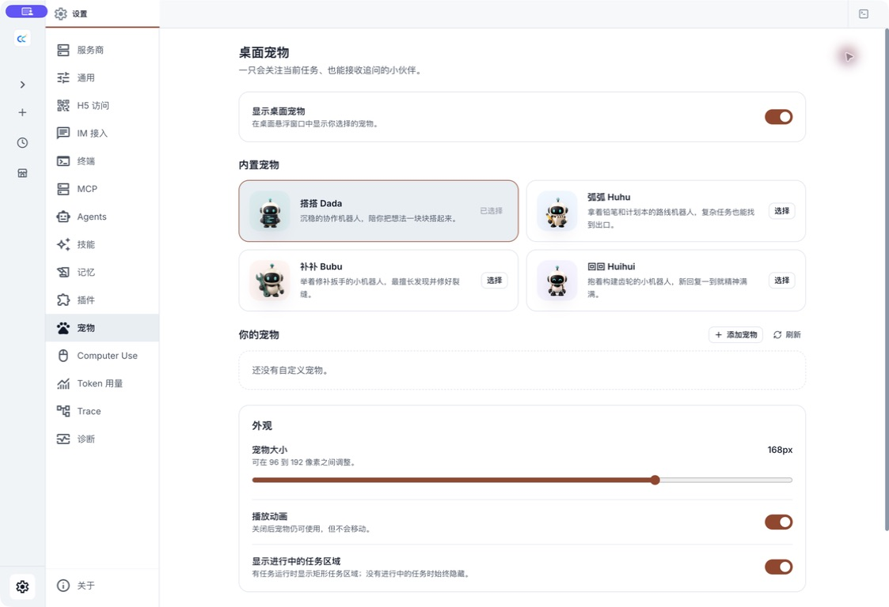
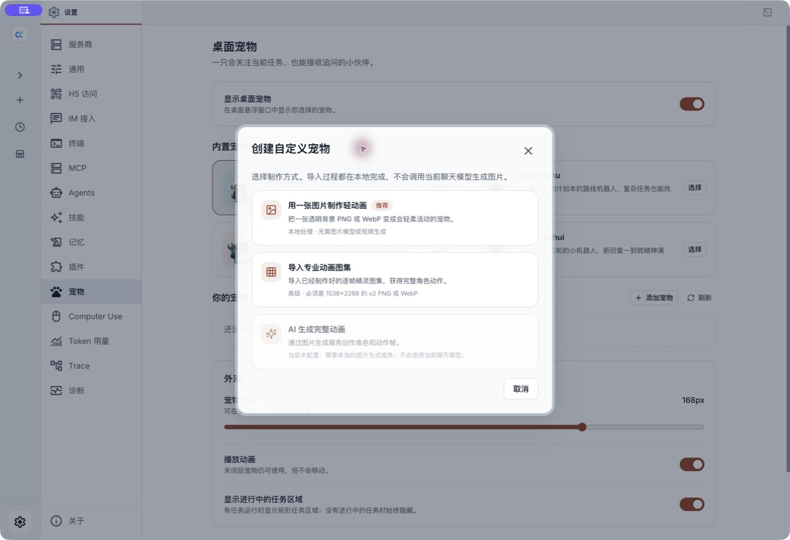
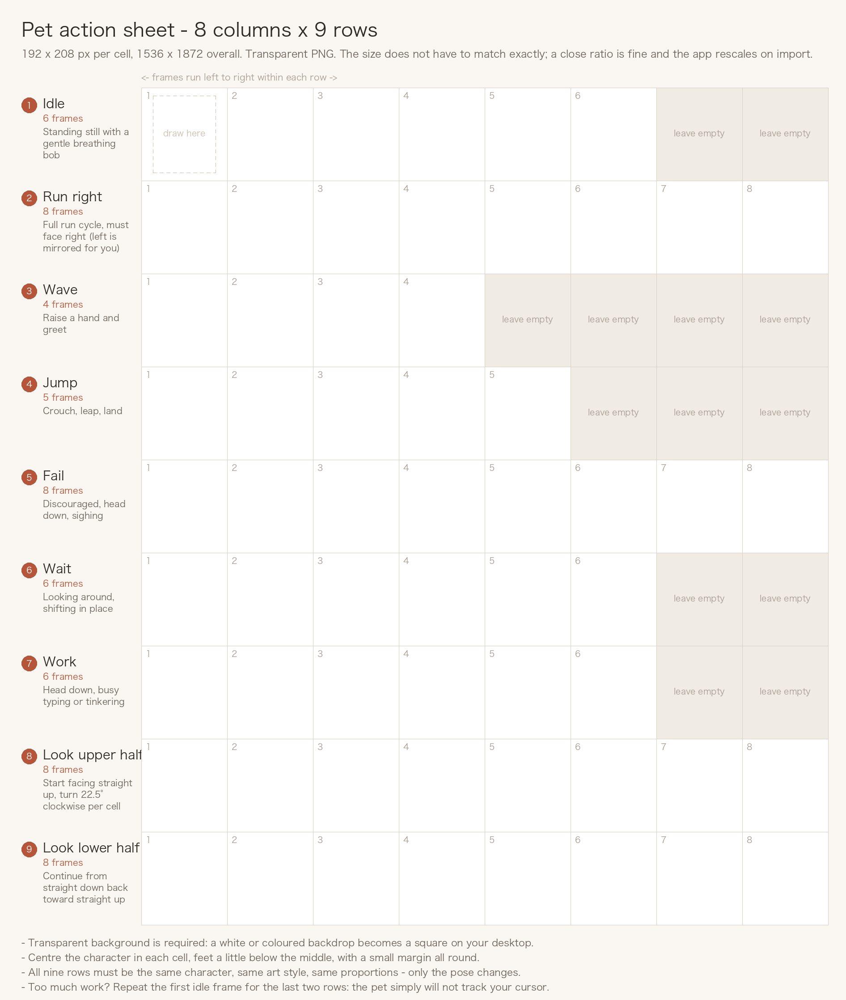
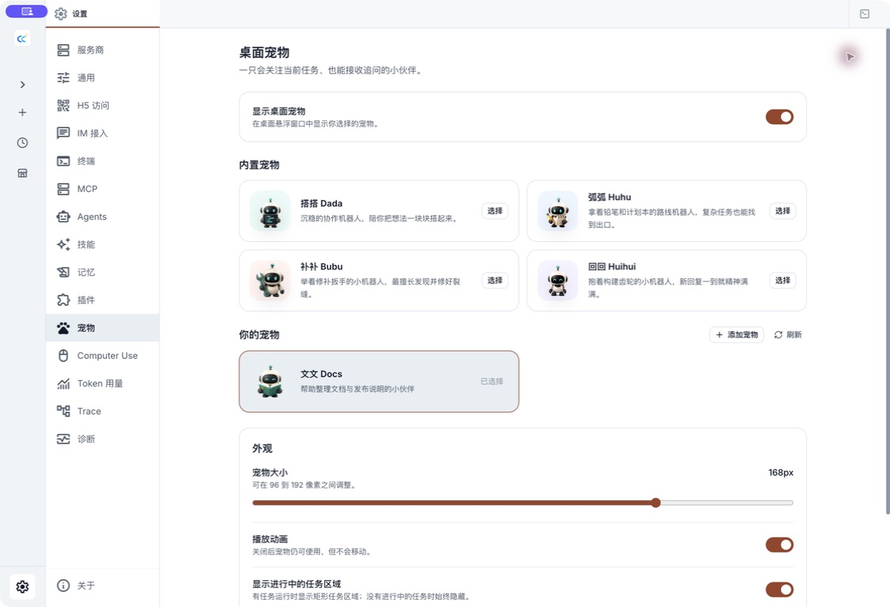

# Desktop Pets

Desktop Pets are optional companions that live in a small transparent window outside the main app. They reflect a few useful session states, provide a quick way back to active sessions, and can be replaced with your own local artwork.

Pets are an **Electron Desktop feature**. They do not appear in H5 or the browser-only Web UI.



## Enable a pet

1. Open **Settings → Pets**.
2. Turn on **Show desktop pet**.
3. Choose one of the four built-in companions:
   - **Dada**, the coding companion;
   - **Huhu**, the planning companion;
   - **Bubu**, the fixing companion;
   - **Huihui**, the building companion.
4. Adjust the size between `96px` and `192px`.
5. Choose whether to play animations and show the active-task panel.

The selected pet, size, window position, animation preference, and task-panel preference are restored between launches.

## Interact with the floating pet

| Action | Result |
|---|---|
| Move the pointer near an idle pet | Its gaze follows the pointer; entering the pet also triggers a short jump |
| Click the pet | Bring the main Claude Code Haha window forward and play a wave |
| Drag the pet | Move the floating window; the pet runs in the drag direction |
| Right-click the pet | Open the menu for closing the pet window |
| Click the numbered task badge | Expand the active-session panel |
| Click a session in the panel | Return to that session in the main window |
| Click the arrow below the task list | Collapse the panel back to the numbered badge |

The pet can visibly distinguish working, waiting for you, failed, and idle states. The panel is a navigator, not an approval surface: return to the main app to handle any pending interaction, approve or deny a tool, stop work, or inspect full output.

When there are no active sessions, the task panel stays hidden. Disabling **Show active task panel** keeps active work behind the numbered badge instead of removing or stopping it.

The animation switch affects the pet only. Turning it off does not stop sessions. Claude Code Haha also respects the operating system’s reduced-motion preference.

## Create a custom pet

Select **Add pet** under **Your pets**. The dialog offers three ways to make one. Images are processed entirely on your own computer: nothing is uploaded, and no chat quota is used.



Before choosing a file, enter:

- a Pet ID of at most 73 characters, containing only lowercase letters, numbers, and single hyphens, such as `docs-helper`;
- a display name;
- a short description.

The ID must be unique among your custom pets.

### Option 1: use a picture you already have

The quickest route, about a minute. Pick a static image with a transparent background and the app adds breathing, floating and status motion locally.

The image must have:

- PNG or WebP format (APNG and animated WebP are rejected);
- width and height between `32px` and `4096px`;
- no more than `16,777,216` total pixels;
- a file size no larger than `8MB`.

This kind of pet only sways gently. It **will not run, and it will not track your cursor**. For full motion, use option 2.

### Option 2: draw one with AI that runs and jumps

About ten minutes, and you need an AI that can draw. The dialog walks you through the prompt, the reference template and the checks.

#### Step 1: have an AI draw an action sheet

Open any AI that can draw (Nano Banana, ChatGPT image generation, Midjourney, Stable Diffusion and Jimeng all work — these are examples, not endorsements) and send it the whole block below, replacing the two "Character" lines with what you want:

```text
Draw me a game character action sheet (sprite sheet).

[Character]
A round-headed orange kitten wearing a small blue scarf, chibi
three-heads-tall proportions, 3D cartoon render, soft glossy
surface, bright cheerful colours.
(Replace these lines with your own character - the more specific the better)

[Whole image]
- Fully transparent background: no backdrop colour, no grid lines, no text, no drop shadow
- Divide the image evenly into 8 columns x 9 rows, 72 equally sized cells
- One action frame per cell, character centred with a little margin around it
- Every cell must show the same character with identical proportions, colours and art style
- Leave unused cells fully transparent

[What to draw in each row]
Row 1, first 6 cells: standing still with a gentle breathing bob
Row 2, all 8 cells: a full run cycle facing right, always facing right
Row 3, first 4 cells: raising a hand and waving hello
Row 4, first 5 cells: crouch, leap, land
Row 5, all 8 cells: dejected and downcast, head lowered, sighing
Row 6, first 6 cells: waiting in place, glancing around
Row 7, first 6 cells: head down, busy working
Row 8, all 8 cells: head and gaze starting straight up, turning slowly to the right through upper-right, right and lower-right, ending near straight down
Row 9, all 8 cells: continuing from straight down, turning left through lower-left, left and upper-left, back to near straight up
```

Getting it wrong on the first try is normal. Ask for a redraw, or say "keep the character, redraw row 2 only".

#### Step 2: check it against the template



When the picture is ready, check three things before importing:

1. **The background is see-through, not white.** A white backdrop becomes a square on your desktop; this is the most common mistake.
2. **8 cells across, 9 rows down**, one action per cell.
3. **The same character throughout**, with no change of face, colours or proportions.

**Save the template** in the dialog writes this reference image to disk so you can lay out frames against it.

#### Step 3: pick the file

Fill in the ID, name and description, then select the picture. **You do not need to resize anything** — see "Sizes are aligned for you" below.

### Option 3: I already have an action sheet

If you have drawn a sheet already, or hold a finished atlas, this path skips the walkthrough and goes straight to the form. Validation is identical to option 2.

### What to draw in each row

You only draw **nine rows**; the app derives the rest:

| Row | Content | Frames needed |
|-----|---------|---------------|
| 1 | Idle: standing still with a gentle breathing bob | 6 |
| 2 | Run right: full run cycle, always facing right | 8 |
| 3 | Wave: raise a hand and greet | 4 |
| 4 | Jump: crouch, leap, land | 5 |
| 5 | Fail: discouraged, head down, sighing | 8 |
| 6 | Wait: looking around, shifting in place | 6 |
| 7 | Work: head down, busy | 6 |
| 8 | Gaze, upper half: straight up turning clockwise to near straight down | 8 |
| 9 | Gaze, lower half: continuing from straight down back to near straight up | 8 |

Notes:

- **You do not draw "run left".** The app mirrors row 2 horizontally to produce it.
- **The last two rows are optional in practice.** Repeat the first idle frame and the pet simply will not track your cursor; everything else still works.
- Leave unused cells at the right of each row fully transparent.

### Sizes are aligned for you

After you pick the file, the app assembles the runtime atlas locally: it slices the sheet on an 8 × 9 grid, rescales each cell to `192 × 208`, centres the character, mirrors the run row, and fills in the remaining runtime rows to reach `1536 × 2288`.

That means:

- **Exact dimensions are not required.** Common AI output sizes such as `1024 × 1152` work; a ratio close to 8:9 gives the best result. The reference size is `1536 × 1872`.
- **A finished `1536 × 2288` atlas is kept byte-for-byte** and is never resampled.
- The assembled file stays under `8MB`; WebP encoding is used automatically if a lossless PNG would exceed it.

### Common problems

| Message | Cause and fix |
|---------|---------------|
| This image has no transparent background… | The sheet was exported on a white or coloured backdrop. Ask for a transparent PNG, or remove the background with an editor. |
| This image cannot be sliced into 8 columns by 9 rows | The row or column count is off. Confirm 8 across and 9 down, or use a finished `1536 × 2288` atlas. |
| That image could not be read | An animated file (APNG / animated WebP) or a corrupt one. Use a static PNG or WebP. |
| That image is too big | The source exceeds 8 MB. Compress it, or ask for smaller output. |
| A pet with this ID already exists | Choose a different Pet ID, or remove the existing one (see "Storage and removal"). |

When the size, format, or image content does not meet these rules, the app refuses to create the pet and shows the matching error instead of adding an invalid entry.

After a successful import, the new pet is selected automatically and appears under **Your pets**.



## Storage and removal

Custom pet packages are stored under:

```text
${CLAUDE_CONFIG_DIR:-~/.claude}/cc-haha/pets
```

Use **Open folder** in Pet settings to open the resolved directory. This is also the current removal path:

1. Select a built-in pet first if the package you are removing is active.
2. Open the custom pet folder.
3. Remove only the custom pet’s own package directory.
4. Return to Pet settings and select **Refresh**.

Closing or disabling the floating window does not delete a custom pet. If a selected package goes missing, the app falls back to a built-in pet.

The loader skips invalid or unsafe packages and reports how many folders could not be loaded. Do not replace package files while an import is still running, and avoid symbolic links or unsupported animated image formats.

## Privacy, safety, and boundaries

- Image selection, validation, copying, and lightweight animation are local operations.
- Importing a pet does not send the image to the selected chat model.
- A pet can show summarized task state and navigate to a session, but it cannot approve permissions, answer model questions, or control a task directly.
- Pets do not run in H5, IM integrations, or a browser-only deployment.
- The pet observes the local Desktop service; it is not a cloud monitor and does not stay active after the Desktop app exits.
- Always-on-top behavior, dragging across displays, and window placement can vary by operating system and desktop environment.
- A successful application build does not by itself prove pet-window behavior on every supported operating system.

If the pet does not move, check both **Play animations** and the operating system’s reduced-motion setting. If it does not appear at all, turn **Show desktop pet** off and on once, then restart the Desktop app before editing stored files manually.
